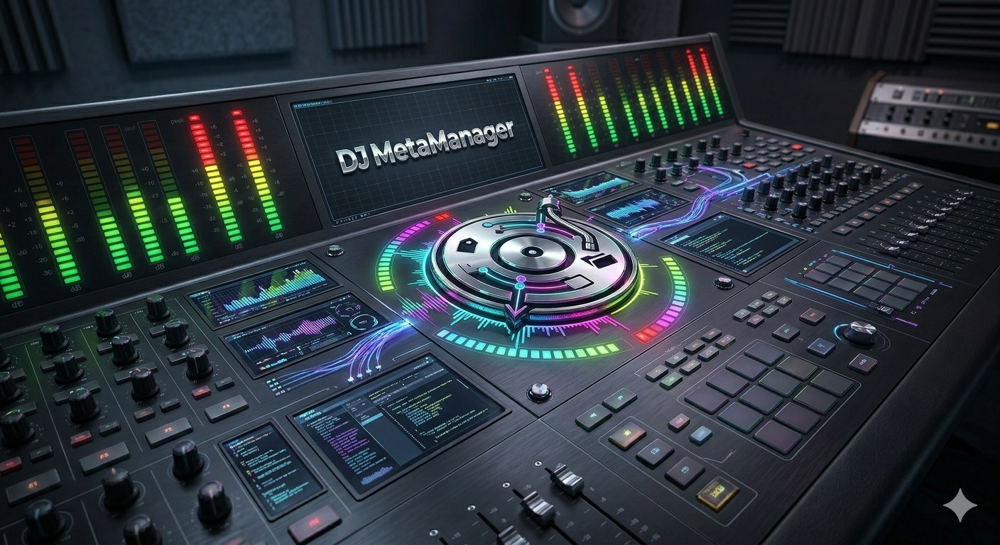

# DJ MetaManager

<p align="center">
  
</p>

<p align="center">
  
  <br />
  <sub>Dark UI: fixed <a href="static/bg-dark-background.png">full-viewport scenic background</a> with semi-transparent (“glass”) panels; <a href="static/header-logo-dark-112h.png">112px-tall wordmark</a> in the header (light theme uses separate assets).</sub>
</p>

A local web tool for DJs to turn recordings into a clean, tagged library in **multiple audio formats**. Record vinyl or other sources through OBS with BlackHole, then extract audio from video containers, auto-tag with metadata and artwork from Discogs, Bandcamp, Apple Music, Spotify, **SoundCloud**, **Beatport**, or other pages, and export to **FLAC (lossless)**, **MP3**, or **AAC (M4A)** — whatever you choose in Settings — ready for Rekordbox, Traktor, or any DJ software.

**Fix Metadata** and **Inspect** work across **FLAC, MP3, M4A/AAC, AIFF, OGG**, and more for browsing and editing. **Normalise** applies **EBU R128** loudness to existing files (single or **bulk folder**) and re-encodes using the same **system-wide format** as Extract. A **Settings** tab controls paths, output format, **MP3/AAC bitrate**, and loudness targets.


## Version & branches

| Branch | Purpose |
|--------|---------|
| **`master`** | Stable release; multi-format extract, tag, and normalise as documented below. |
| **`v2`** | Active development; new features land here first, then merge to `master` when ready. |

**On branch `v2` today:** **tab bar icons** with hover/focus labels; Extract **Rename** / **Delete** for source recordings (delete → Finder Trash on macOS; `POST /api/source-recording/rename` | `delete`), **SoundCloud** and **Beatport** URLs in **Fetch metadata**; **Bulk Fix → Reset form** to clear saved browser state; plus **Bulk Fix** (batch FLAC metadata, Bandcamp search, duplicate-name warnings, optional sibling `.wav` hints, **best-match pre-selection** after fetch), batch **WAV/AIFF → FLAC** with offsets and **browser-stored batch progress**, **conversion-order handoff** to Bulk Fix for flat output (see [UI state](#ui-state-browser)), in-app **bulk convert confirmation** (no native `confirm` dialog), **per-tab UI drafts** for Extract / Fix / Inspect / Normalise / Settings in `localStorage`, **Inspect** folder picker, last browsed folder remembered between **Fix Metadata** and **Inspect**, **UTF-8–safe** HTML/JSON scraping so accented titles (e.g. Apple Music) write correctly to tags, **Fix List** for batch-fixing tracks from a [Rekordbox Library Manager](https://github.com/apj72/music_library) CSV export with **background auto-search**, **Lossless Check** (FFT spectral analysis to detect lossy transcodes with bitrate estimation and saved reports), **Saved Links** (bookmark URLs for later), and **default artwork** embedded automatically when files have no cover art.

**Also on `v2`:** A fixed **audio preview bar** on every tab streams the selected file via **`GET /api/stream-audio`** (manual Play / Pause, draggable timeline, volume stored in `localStorage`). **Fix Metadata** supports a separate **Artwork image URL**, **Update artwork** (cover only, `POST /api/retag-artwork`), **click the cover** for a full-screen preview, and save rules that **prefer your local or URL cover** over release art; **Fix** and **Inspect** file lists use **arrow keys / Home / End** to move selection (like a focusable list), not only scroll.

## Recording

This workflow assumes you capture mixes or vinyl rips as **video recordings** (often `.mkv`) using **[OBS Studio](https://obsproject.com/)** with a virtual audio device such as **[BlackHole](https://existential.audio/blackhole/)** on macOS. **OBS** is a practical choice because it is **free and open source**, can **record video** when you want a visual timeline or camera view, and supports **streaming** as well as local capture — one familiar tool for several setups.

OBS is still primarily a **video** app: even when you only care about audio, it often writes **`.mkv`** files. If you use a **lossless encoder (e.g. FLAC)** in OBS, that audio sits inside a large container alongside an unnecessary video stream. DJ MetaManager strips the audio, optionally normalises it, tags it, embeds artwork, and writes a **library-ready file** in your chosen format. You can also start from **lossy** source codecs and encode to MP3 or AAC when that fits your workflow.

## What It Does

Twelve pages, via tabs at the top (order: **Extract → Inspect → Fix Metadata → Bulk Fix → Fix List → Normalise → WAV/AIFF → FLAC → Lossless Check → Saved Links → Capture Playlist → Settings**). An optional, experimental **Playlist Builder** tab (browse your Apple Music library and create playlists) is hidden by default; enable **Settings → Show Playlist Builder tab** to reveal it.

### Extract (main workflow)

1. **Extracts audio** from MKV/MP4/MOV — output codec and container follow **Settings → extract format** (FLAC 16-bit, MP3 320 CBR, or AAC in M4A). When the source stream already matches the target, ffmpeg copies or transcodes as appropriate; video is discarded.
2. **Analyses audio levels** — integrated LUFS, true peak, mean volume with colour-coded meters. For **`.mkv`** files you can disable this automatic analysis in **Settings** (faster for very long OBS captures); the Extract UI explains when it is off. **Normalised extract** always measures the source on the server when you enable it.
3. **Normalises audio** (optional) — two-pass **EBU R128** `loudnorm` to the **LUFS target in Settings** (default **-14**; use **-11.5** to align with tools like Platinum Notes). Toggle on/off per extract.
4. **Fetches metadata** from Bandcamp, Discogs, Apple Music, Spotify, **SoundCloud**, **Beatport** (track URLs), or generic pages.
5. **Rename** or **Delete** source videos from the list (**Delete** moves to **Finder Trash** on macOS; both use in-app dialogs).
6. **Embeds artwork** and **stores the metadata source URL** in the file (`DJMETAMANAGER_SOURCE_URL` Vorbis comment / MP3 TXXX; older files may still use `DJFLACTAGGER_SOURCE_URL`, which is read for compatibility) and in the **processing log** for later re-fetch.
7. **Copies** the tagged file to your **destination** folder.
8. **Moves the source recording to Bin** (optional, macOS Finder).
9. **Platinum Notes (optional)** — in Settings, set the **exact app name** (e.g. `Platinum Notes 10`). On Extract you can **open the extracted file in Platinum Notes** and **watch for the `*_PN` output** (same base name and extension family); when it appears, tags and artwork are **re-applied** from the same log entry (and the PN file is **copied next to your library copy** when a destination copy exists).

Paths, loudness targets, and Platinum Notes options live on the **Settings** tab.

### UI state (browser)

The app does **not** use cookies for form memory. **Extract**, **Fix Metadata**, **Inspect**, **Normalise**, and **Settings** save **debounced drafts** to **`localStorage`** under **`djmm.pageState`** (see `static/path-persist.js`: `djmmPageStateSchedule` / `djmmPageStateGetPage`). When you switch tabs and come back in the same browser profile, folders, fields, and selected files are restored where possible.

- **Settings:** After you click **Save Settings**, the settings draft is cleared so the next load matches the server.
- **WAV → FLAC** and **Bulk Fix** use **additional** keys (e.g. bulk folder/target memory, batch offset handoff, `djmm.bulkFixHandoff` after a flat-folder convert) so large workflows stay separate from the generic page store.
- **Bulk Fix** also exposes **Reset form** — clears folder fields, loaded batch, `djmm.bulkFixState`, `djmm.bulkFixDir`, and any pending WAV→FLAC **`djmm.bulkFixHandoff`** for a clean slate in this browser profile.
- **Fix List** persists the full track list, search results, and completed paths **server-side** as `fix_list_state.json` (via `GET/POST/DELETE /api/fix-list/state`). This survives app rebuilds — unlike browser-only `localStorage`. Navigate away and return without losing progress. The **background search queue** automatically resumes for any unfetched tracks on page restore.
- **Audio preview bar** (`static/player.js`): included on all main tabs; loads the current selection when the format is supported. **No autoplay** — use **Play** / **Pause**. Keyboard shortcuts on the timeline when focused: arrows, Home/End, Space to toggle playback.
- **Appearance (browser-only):** **Theme** preference is **`djmm.themePreference`** (`dark`, `light`, or `system`). **Full-page scenic background** can be toggled with **`djmm.pageBackgroundEnabled`** (`1`/`0`); Settings → Appearance includes both. See **[Appearance](#appearance)** for assets and styling.

### Audio preview bar (all tabs)

When you select a **playable** audio file on **Extract**, **Fix**, **Inspect**, **Normalise**, or **WAV → FLAC**, the bottom bar offers **Play** / **Pause**, a **seekable** timeline (click or drag; supports HTTP range requests), **volume** (remembered as `djmmPlayerVolume` in `localStorage`), and a **buffer** hint while data loads. **Video-only** sources on Extract (e.g. `.mkv`) show that in-browser preview is not available for that type. Playback uses the browser’s codecs (e.g. FLAC support varies by browser).

### Fix Metadata

Browse audio files (multiple formats), auto-search iTunes, Discogs, and Bandcamp, fetch from URLs, edit fields, **save tags and artwork**. The **Fetch from URL** field (metadata source) is separate from the **Artwork image URL** under the cover: you can paste a **direct image link** and use **Update artwork** to embed **only** the cover without rewriting other tags, or rely on **Save Tags & Artwork** with priority **local file → artwork URL → release art** from search. **Mix metadata and artwork from different search results** (same as **Fix List**): after picking a first result, click another result's **cover thumbnail** to take *just its artwork* (the highest-resolution version is fetched, your text fields untouched), or click its **text** to swap *just the metadata* while keeping the artwork you chose; the result supplying artwork is outlined. **Click the cover** for a full-screen preview. The **URL field** (metadata) is saved into the file and into the **processing log** where applicable. **Saved metadata URL** appears on **Inspect** for FLAC/OGG/MP3 where supported.

On the file list, **ArrowUp / ArrowDown / Home / End** move the highlighted file and load it (when you are not typing in a text field or the folder modal is not focused)—same idea as **Inspect**.

When a file has no useful tags, the **suggested search** string is derived from the **filename** using the same rules as **WAV → FLAC** tags and **Bulk Fix** (see [Filename search and tags](#filename-search-and-tags) below). **Rename to tags** can keep configured **trailing suffixes** (e.g. `_warped`) before the extension when set under **Settings → Fix Metadata filename suffixes**.

**Folder path:** The last folder you successfully listed in **Fix** or **Inspect** is remembered in the browser (alongside **Default** from Settings), so switching between those tabs keeps the same directory.

### Inspect

Full tag table, artwork preview, **Fix artwork dimensions** for **FLAC**, **MP3**, **M4A**, and **AIFF** (Rekordbox-friendly). Shows **Saved metadata URL** when present. Pick a folder with **Choose folder…** (server-side navigator), **Default** (Settings destination), then **List files** — useful for reviewing a flat **Converted WAVs** tree after bulk conversion. Deep link: **`/inspect?dir=/path/to/folder`**. **Arrow keys / Home / End** change the selected file in the list (same behaviour as **Fix Metadata**) when focus is not in a text field.

### Normalise

Pick a **supported audio file**, analyse levels, then **normalise** to your **Settings** LUFS target. Output uses **the same extract format as Settings** (FLAC, MP3, or AAC/M4A): **`{stem}{suffix}{extension}`** (default suffix `_LUFS14`). **Tags and artwork are copied** from the source.

- **FLAC:** Prefers the Xiph **`flac`** CLI when installed (`brew install flac`): **`flac --best -e -p`**. Otherwise FFmpeg’s FLAC encoder (`-compression_level 12`). **16-bit** at the source sample rate/layout. Normalised files are often **larger** than the original at the same rate/bit-depth because the waveform is harder to compress — that is normal and still lossless.
- **MP3 / AAC:** Encoded with FFmpeg after loudnorm (lossy). Bitrate follows **Settings → MP3 bitrate / AAC bitrate**.

**Bulk normalise:** Browse a folder, scan for supported audio files, then normalise all of them in one run. Progress streams to the browser via **NDJSON** so you can watch each file complete in real time.

**Sample rate and channel layout** follow the source where applicable so outputs stay e.g. **48 kHz**, not accidentally upsampled.

### Platinum Notes

**Platinum Notes** is optional: many DJs use it for loudness or “polish” passes on finished files. DJ MetaManager can **open an extracted file in Platinum Notes** from the Extract step and **watch for its processed output** (typically a sibling file with a configured suffix, e.g. `_PN`). When that file appears, the app can **re-apply the same tags and artwork** from your processing log, and optionally copy the result next to your library copy. Set the **exact macOS app name** and output suffix under **Settings**.

#### Platinum Notes and file format

If you use **Extract → open in Platinum Notes → watch for processed output**, set Platinum Notes to **Match input format** (and choose an output location **other than** “Replace Original Files,” as Platinum Notes requires). Then the `*_PN` file keeps the **same extension** as the file this app wrote (e.g. both `.flac` or both `.mp3`), matching your **extract format** in Settings. If PN uses a **fixed** output type that does not match, automatic repair may look for the wrong filename.

**Output folder:** The app looks for `<title><suffix>.<ext>` (e.g. `Song_PN.flac`) in this order: next to the **initial extract** (same folder as the recording), next to the **library copy** if Extract copied to **Settings → destination** (e.g. your FLACs tree), and **flat in the destination folder** itself. So you can point Platinum Notes at your **FLACs / destination** folder only — polling still finds the finished file as long as the **base name** matches (same stem as the extract, plus the configured suffix).

### Settings

- **Source / destination** folders  
- **Fix Metadata / Inspect default folders** (optional; when empty, the **destination** folder is used for the initial path and **Default** on those tabs)  
- **Extract format** — global default for **Extract** output and **Normalise** re-encode  
- **MP3 bitrate** — CBR bitrate for MP3 output (128 / 192 / 256 / 320 kbps; default 320)  
- **AAC bitrate** — CBR bitrate for AAC/M4A output (128 / 192 / 256 kbps; default 256)  
- **Extract — analyse .MKV audio levels** — when off, skips the automatic full-file loudness meters on the Extract tab for `.mkv` only (faster for long recordings); **normalised extract** still analyses on the server  
- **Fix Metadata — filename suffixes** — list of literals or `regex:` lines (`fix_retain_filename_suffixes` in `config.json`): peeled from the end of the stem **before** building search queries; **re-appended** when renaming to `Artist - Title` (see [Filename search and tags](#filename-search-and-tags))  
- **Platinum Notes** app name and **`_PN` output suffix**  
- **Loudness target (LUFS)** and **true peak (dBTP)** — e.g. **-11.5** / **-1** to match Platinum Notes; **-14** / **-1** for streaming-style reference. You may enter **11.5** (positive); it is treated as **-11.5 LUFS**.
- **Show page background image** — full-page scenic art toggle (browser preference `djmm.pageBackgroundEnabled`, also mirrored to `config.json`).
- **Show Playlist Builder tab** — reveals the optional, experimental **Playlist Builder** tab (browse your Apple Music library and create playlists). **Off by default** (browser preference `djmm.showPlaylistBuilderTab`, also mirrored to `config.json` as `show_playlist_builder_tab`).

### WAV/AIFF → FLAC

Convert **WAV** or **AIFF** recordings to **FLAC** (ffmpeg, compression level 12). Source files are never deleted. AIFF files typically see a **25–30% size reduction** when converted to FLAC (both are lossless). When an AIFF has embedded ID3 tags and artwork, they are **copied to the output FLAC** automatically.

- **Single file** — browse a folder for `.wav` or `.aiff`, choose output next to the file or under **Settings → destination**.
- **Bulk (folder tree)** — convert every `.wav` and `.aiff` under a root (optionally recursive). Output modes:
  - **Next to each WAV** — write `<name>.flac` beside the source.
  - **Mirror under destination** — preserve subfolders under your **Settings** destination (avoids name collisions across BPM folders).
  - **One flat folder** — e.g. all converted files into a single destination directory; output names follow **[Filename search and tags](#filename-search-and-tags)** when the **WAV stem** matches a known **Ableton-style** pattern (see below). **Pioneer Rekordbox** does not define a special on-disk filename format: it uses **embedded metadata and its own database**; files are often _also_ given hyphenated “Ableton performance” names when exporting for **Ableton Live** (sample browser / set prep).
- **Tags from filename** — after each encode, **artist** and **title** Vorbis tags are set when the stem can be parsed (see below; aligned with **Fix Metadata** and **Bulk Fix**).
- **Batching (recommended for large trees)** — by default, each run only processes a **batch** of WAVs in **sorted path order** using **offset** and **limit** (e.g. 25 per run). Use **Next offset** to step through hundreds of files safely; keep **skip if FLAC exists** on to resume. Uncheck “limit each run” only if you intentionally want one run for the whole tree (you’ll get a stronger warning when the scan count is high). Successful limited batches can **persist the next offset** per source folder (browser only).
- **Bulk run confirmation** uses an in-page modal (same style as the folder picker), not the browser’s native confirm dialog.
- After a successful **flat-folder** run, the API returns **`batch_flac_paths`**: the **exact output `.flac` paths in conversion order** for that run (not alphabetical order in the flat folder, which often differs when BPM subfolders drive WAV sort). **Open Bulk Fix** stores a short-lived handoff and opens **Bulk Fix** so that batch loads via **`POST /api/bulk-fix/scan-paths`** instead of folder offset/limit alone.

### Bulk Fix (metadata in batches)

For a **folder of FLACs** (often the same flat folder as **WAV → FLAC** output), review and apply **Discogs, Apple Music, Bandcamp**, or pasted URLs (**SoundCloud**, **Beatport**, etc.) **without** doing one file at a time on **Fix Metadata**.

1. **Scan & load** — choose root, **files per pass**, and **offset** (same idea as WAV batching: stable sorted list). If the same **filename** exists more than once (e.g. in different subfolders, or two copies in the same batch), the table flags **Duplicate in this batch** or **Same name elsewhere** and lists other paths; the apply step warns if you are about to tag multiple copies.
2. **Fetch online matches** — runs the same combined **iTunes + Discogs + Bandcamp** search as Fix, with gentle rate spacing between files. The **search query** for each file is built from the **filename stem** using [Filename search and tags](#filename-search-and-tags). After results return, the **Match** dropdown **pre-selects a best guess** (filename hints + light source tie-break) so you can skim and only change wrong rows.
3. **Review** — per row, pick a search result or paste a **catalogue URL** (Bandcamp, Discogs, Apple, Spotify, **SoundCloud**, **Beatport** track links, …). After **Fetch online matches**, each row lists **shortcuts (Apple / Discogs / Bandcamp)** and the **full URL** for every hit (same URL the dropdown uses), so you can open and validate in the browser before apply. The **Match** column uses high-contrast link colours on a slightly lighter cell background so URLs stay readable on dark mode.
4. **Apply** — fetches full metadata, matches **multi-track** Discogs releases using the **title hint** from the filename when possible, embeds tags and artwork; optional **rename to `Artist - Title.flac`** (suffixes configured in **Settings** for search/retain are preserved at the end of the stem when renaming). Optional logging to the processing log.

**Optional same-name `.wav`:** If `SomeTrack.wav` sits in the **same folder** as `SomeTrack.flac`, the server reads **embedded WAV tags** (when mutagen can see them — e.g. some BWF/RIFF metadata). If **both** artist and title are present in the WAV, the **search query** uses that pair (often cleaner than the filename alone). If only one of those fields exists, it can still **fill title/artist hints** for track matching without replacing the whole query. Many exports have **no** useful WAV tags, so the filename rules above still do most of the work.

The **WAV → FLAC** tab links here after a flat-folder conversion with **`?dir=...`** and a **handoff** of **`batch_flac_paths`** when available; you can still open **`/bulk-fix?dir=...`** with optional **`offset`** / **`limit`** for ordinary folder paging.

### Fix List (Rekordbox Library Manager integration)

Import a CSV "fix list" exported from [**Rekordbox Library Manager**](https://github.com/apj72/music_library) to batch-fix tracks with missing metadata across your entire Rekordbox library — any format (FLAC, MP3, M4A, AIFF, OGG).

**Workflow:**

1. In **Rekordbox Library Manager**, filter tracks by missing metadata (title, artist, BPM, key, artwork) and export a fix list CSV.
2. On the **Fix List** tab, upload the CSV. DJ MetaManager reads the actual file tags from disk and shows what is missing.
3. **Background search** starts automatically — tracks are searched one at a time against Apple Music, Discogs, Bandcamp, SoundCloud, and Beatport. Results appear in the track list as they complete (purple dot = matches ready, spinner = searching). A 1-second delay between tracks respects API rate limits. The queue **pauses after 25 tracks** and resumes when ~75% are processed — this avoids wasting API calls on tracks you may not get to.
4. Click any track to see its current tags, search results (with **artwork thumbnails** and coloured source badges), and options. The best match is **auto-selected** using the same scoring as Bulk Fix. Change the selection or paste a URL manually.
5. **Apply** writes metadata and artwork into the audio file. The track shows a tick when done.
6. **Export completed paths** downloads a CSV of fixed file paths. Import this back into Rekordbox Library Manager to create a temporary Rekordbox playlist — select all tracks in that playlist, right-click → **Reload Tags** to pull the updated metadata into Rekordbox's database.

**State is fully persistent** — saved to the server (not browser localStorage), so it survives app rebuilds. If you close the app and reopen it, already-fetched results are preserved and the background search resumes from where it left off. No work is lost.

**CSV format** (contract between the two apps):

```csv
full_path,file_name,title,artist,bpm,key,file_type,missing_title,missing_artist,missing_bpm,missing_key,has_artwork
```

See [Rekordbox Library Manager](https://github.com/apj72/music_library) for the export side of this integration. See the [Fix List user guide](docs/user-guide/workflow-fix-list.html) for detailed documentation with screenshots.

#### Filename search and tags

DJs often keep **extra text in the filename** (Camelot key, BPM, etc.) for quick scanning in a DAW or file browser. The app **does not** search on the raw stem; it normalizes first so Discogs, Apple, and Bandcamp get a useful query.

**Configurable trailing markers:** under **Settings → Fix Metadata filename suffixes** (`fix_retain_filename_suffixes` in `config.json`, a JSON array of strings). Each entry is either a **literal** suffix matched at the end of the stem, or `regex:` plus a pattern (usually ending in `$` for a true suffix). The server peels these from the **end** of the stem (repeatedly, in rule order) **before** the steps below; those fragments are **omitted from the search query** and **re-appended before the extension** when you rename to `Artist - Title`.

**Pioneer Rekordbox** identifies tracks from **metadata and its internal database**, not from a special filename format. A folder such as `…/Rekordbox-music/Underground/126/` is simply how **you** arranged exports; the stems below are patterns people commonly use with **Ableton Live** (and similar tools) when **loading samples** or preparing a performance: **hyphens** separate fields in the name for readability in Ableton’s browser. The same file may also live in a Rekordbox collection, but the **naming** described here is **Ableton-style**, not a Rekordbox requirement.

1. A **`_PN` suffix** (Platinum Notes) on the stem is removed, e.g. `Track_PN` → `Track` (case-insensitive).
2. **Ableton / export pattern — BPM in the second field** (hyphen-separated): if the name looks like  
   `[key or slot] - [BPM] - [artist] - [title]`  
   (e.g. `A06 - 139 - Members Of Mayday - 10 In 01`), that pattern wins — **no** further stripping, so the hyphens in the real title are preserved. Here **BPM** is a 2–3 digit number in the **second** field.
3. **Ableton performance / sample layout** (also hyphen-separated): a common convention is  
   `[leading key] - [artist] - [title] - [Camelot key] - [BPM]`  
   e.g. `A01 - Pleasurekraft - One Last High (Tiger Stripes Remix) - 1A - 126` — leading token is a **Camelot-style** code, then **artist**, then **track name**, then **key** and **BPM** repeated at the end. After metadata is fixed in the app, a typical library filename becomes **`Artist - Title.flac`**, which may not match the original stem word-for-word.
4. **Otherwise** (e.g. older flat exports with spaces) the stem is cleaned:
   - **Trailing** [Camelot key] + [BPM], e.g. ` 2A 120`, `12A 98`, or ` - 8A - 118` (with hyphens) at the **end** of the stem.
   - **Leading** key/slot prefix, e.g. `A02 ` or `B12 ` (one letter + 1–2 digits + space).

**Examples after normalization:**

| Filename stem (no extension) | Search / tag string used |
|------------------------------|-------------------------|
| `A06 - 139 - Members Of Mayday - 10 In 01` | Artist + title from the **BPM-in-second-field** pattern (unchanged) |
| `A01 - Pleasurekraft - One Last High (Tiger Stripes Remix) - 1A - 126` | Artist = Pleasurekraft, title = One Last High (Tiger Stripes Remix) |
| `A02 Christian Loeffler All Comes (Mind Against Remix) 2A 120` | `Christian Loeffler All Comes (Mind Against Remix)` |
| `A02 Ripperton Unfold 2A 119` | `Ripperton Unfold` |

These rules apply to **Bulk Fix** (scan query and title hint), **Fix Metadata** (suggested search from the filename), and **WAV → FLAC** tag embedding when a known pattern does not match.

### Lossless Check (spectral analysis)

Scan a folder of audio files and use **FFT-based spectral analysis** to detect whether lossless files (FLAC, WAV, AIFF) are actually **re-encoded from lossy sources** (e.g. MP3). Lossy codecs apply a low-pass filter that removes high frequencies above a bitrate-dependent threshold; when the file is re-encoded to FLAC, that cutoff remains detectable.

1. **Select a folder** — browse or use the folder picker. Optionally include subfolders.
2. **Scan** — lists all supported audio files (FLAC, WAV, AIFF, MP3, M4A, OGG).
3. **Analyse** — processes each file by decoding a 30-second segment from the middle, computing the FFT, and looking for a sharp energy drop in the 14–21 kHz range.
4. **Results** — each file gets a verdict (**Lossless**, **Transcode**, **Resampled**, or **Inconclusive**), an estimated source bitrate for transcodes (e.g. "~192 kbps MP3"), the detected cutoff frequency, and a confidence level. **Resampled** means a lossless source was sample-rate-converted to a lower rate (e.g. a hi-res 96 kHz master downsampled to 44.1 kHz): the roll-off rides up to Nyquist rather than leaving a silent plateau, so it is *not* a lossy transcode and does not need replacing.
5. **Filter** — toggle between All, Transcodes, Lossless, Resampled, and Other to focus on files that need replacing.
6. **Save reports** — persist analysis results on the server for later reference when sourcing better-quality copies. Load or delete saved reports from the Saved Reports card.

Requires **numpy** (in `requirements.txt`) and **ffmpeg/ffprobe**.

### Saved Links

A simple bookmark manager for music URLs. Save links to Bandcamp pages, Discogs releases, SoundCloud tracks, Beatport listings, or any URL while browsing and tagging — then revisit them later for purchase or processing. Links are stored server-side in `saved_links.json`.

### Capture Playlist (automated Apple Music recording)

Record individual tracks from an Apple Music playlist as separate, lossless **24-bit FLAC** files. DJ MetaManager controls Music playback, drives **OBS Studio** over the WebSocket API to record each track one at a time, converts the recording to FLAC, verifies it, and applies metadata and artwork from the playlist.

**Audio routing:** Music plays into **BlackHole 16ch**; **OBS** captures that device and records an **MKV** with a 24-bit lossless audio track; DJ MetaManager tells OBS when to start and stop over the **OBS WebSocket** and then converts each MKV to FLAC. Muting the system channels in OBS keeps notifications and other apps out of the recording. (Earlier versions used SoundSource/SoundPipe for direct FFmpeg capture — that paid dependency has been retired in favour of OBS.)

```text
Apple Music  -->  System output: BlackHole 16ch (44.1 kHz)
                  -->  OBS "DJ Audio" capture (mute system ch 1/2, keep Music ch 3/4)
                       -->  OBS records MKV (24-bit lossless audio)
                            -->  DJ MetaManager (OBS WebSocket, start/stop per track)
                                 -->  FFmpeg MKV --> 24-bit FLAC
```

**OBS WebSocket config:** set the host, port, and password on the **Settings** tab (under *Capture — OBS WebSocket password*). The password must match OBS's own **Server Password** (OBS → *Tools → WebSocket Server Settings*); leave it blank if authentication is off. Saved values take effect on the next capture — no app restart needed. Use the **Show** button to reveal the password while typing. These map to the following in `config.json` if you prefer to edit it directly:

```json
"capture": {
  "backend": "obs",
  "obs": { "host": "127.0.0.1", "port": 4455, "password": "your-obs-password" }
}
```

**Workflow:**

1. Select a playlist from Music on the **Capture Playlist** tab.
2. Preview the track list and set the output folder.
3. **Run preflight** to verify Music access, the OBS WebSocket connection, and disk space.
4. **Start capture** — each track is played once, recorded via OBS, converted, verified, and tagged automatically.
5. Use **Pause after track**, **Stop after track**, or **Emergency stop** during capture.
6. Review results — retry failed tracks or send to **Bulk Fix** for artwork enrichment.

**Leaving and returning to the tab:** capture runs in a background worker on the server, so it keeps going while you switch to another tab (or close the browser). When you come back to the Capture tab the UI **reconnects** to the live session — the in-progress card and live progress reappear exactly where they were, and a paused, needs-attention, or completed session reopens in its review card. Navigating away no longer resets the tab or interrupts the recording.

**Resuming an interrupted session:** if a run ends with some tracks still failed (for example a network drop stops Apple Music cloud tracks from streaming), the session is **not** marked complete — it is left in a *needs-attention* state so it stays recoverable. If the app itself was restarted while a session was live, the next page load offers to **recover** it; click **Resume capture** and only the outstanding tracks are recorded, in order, from where it stopped. **Retry** on an individual track also restarts processing on its own, so a retried track no longer just sits at *pending*.

**Fix artwork:** external mastering (e.g. Platinum Notes) can strip embedded cover art when it rewrites a file. The **Fix artwork** button at the bottom of the Capture tab re-applies artwork to every completed track in the session — it re-fetches each track's cover from Music and re-embeds it into the current file, touching **only** the picture so tags written by Platinum Notes are preserved. Progress is shown live (`Fixing artwork… 12/31`) with a summary of how many were fixed, skipped (output file no longer at its original path), or failed. Run it **after** your Platinum Notes pass.

**Requirements:** [BlackHole](https://existential.audio/blackhole/) (free, 16-channel version) and [OBS Studio](https://obsproject.com/) (free, includes obs-websocket). See the [Capture Playlist user guide](docs/user-guide/workflow-capture.html) for detailed setup instructions.

### Default artwork

When metadata is applied to a file that has **no existing artwork** and no artwork was fetched from an online source, DJ MetaManager automatically embeds a **default artwork image** (`static/icons/no_artwork.jpeg`). This ensures every file in your library has cover art, even when no release artwork is available. The default is a vinyl record with waveform overlay.

## Recording Setup

- **[BlackHole](https://existential.audio/blackhole/)** — virtual audio on macOS (16-channel version).
- **[OBS Studio](https://obsproject.com/)** — e.g. **FLAC** (or another) audio in an **MKV** container.

### Recommended OBS Settings (lossless capture)

1. **Settings > Output > Output Mode**: Advanced  
2. **Recording > Audio Encoder**: FFmpeg FLAC or ALAC, **24-bit**  
3. **Recording > Recording Format**: MKV  
4. **Settings > Audio > Sample Rate**: **44.1 kHz** — match BlackHole in Audio MIDI Setup (use 96 kHz instead if you want to preserve hi-res bandwidth without downsampling)  

## Requirements

- **macOS** (Finder trash integration for “move recording to Bin”)
- **Python 3.10+**
- **numpy** (for Lossless Check spectral analysis; installed via `pip install -r requirements.txt`)
- **ffmpeg** and **ffprobe**:

```bash
brew install ffmpeg
```

**Optional (recommended for Normalise when output is FLAC — smaller files with the FLAC CLI):**

```bash
brew install flac
```

## Setup

```bash
git clone https://github.com/apj72/dj-meta-manager.git
cd dj-meta-manager
python3 -m venv venv
source venv/bin/activate
pip install -r requirements.txt
cp config.json.example config.json
```

Edit `config.json` or use the **Settings** tab in the UI.

## macOS app bundle (.dmg)

You can ship DJ MetaManager as a **double‑click `.app`** (no Terminal) for less technical users. The interface is unchanged: the app starts a **local web server** and opens your **default browser** at `http://127.0.0.1:5123`.

- **FFmpeg / ffprobe** are not included in the default PyInstaller build; users should install them (e.g. `brew install ffmpeg`) or you can place vendored `ffmpeg` and `ffprobe` under `ffmpeg-mac/bin/` inside the frozen bundle (see `_prepend_bundled_ffmpeg_to_path()` in `app.py` and respect FFmpeg’s license if you redistribute binaries).
- **Settings and processing log** for the bundled app are stored under **`~/Library/Application Support/DJ MetaManager/`** instead of the project directory.
- **Code signing and notarization** are not automated; unsigned builds may require **Right‑click → Open** the first time under Gatekeeper.

Build on **macOS** (PyInstaller + `hdiutil`):

```bash
pip install -r requirements.txt -r requirements-dev.txt
./packaging/build_macos_dmg.sh
```

Outputs: `dist/DJ MetaManager.app` and `build/releases/DJ_MetaManager_macos.dmg`. Spec: `packaging/dj-mm.spec`; GUI entry: `launch_gui.py`.

## Usage

### Start / stop (background)

```bash
./start.sh    # logs to server.log, PID in .dj-meta-manager.pid
./stop.sh
```

### Foreground

```bash
source venv/bin/activate
python app.py
```

Open **http://127.0.0.1:5123** (or `http://localhost:5123`).

### Extract workflow (summary)

1. **Settings** — folders, extract format, LUFS target, Platinum Notes name/suffix.  
2. **Extract** — browse recordings, select a video file, review meters, fetch metadata (paste **Track URL** to log the source).  
3. Optionally **normalise**, **open in Platinum Notes**, **watch for PN output** to auto re-tag.  
4. **Extract** — tagged audio file in your chosen format, optional copy and trash source.

### Processing log

Entries include **`metadata_source_url`**, **`metadata_source_type`**, **`kind`** (`extract` vs `fix`), **`extract_profile`**, and normalisation targets when used. Use **Re-tag** to apply log entries to files in a folder (e.g. after Platinum Notes renamed the file).

## Audio / loudness notes

| Meter | Meaning | Typical healthy range |
|-------|---------|------------------------|
| **LUFS** | Integrated loudness | about -16 to -12 |
| **Peak** | True peak (dBTP) | about -3 to -1 |

Normalisation uses **two-pass EBU R128** with your configured **I** and **TP** targets.

## Metadata sources

| Source | What you get |
|--------|----------------|
| **Discogs** | Full release metadata, artwork, tracklist |
| **Bandcamp** | Track/album metadata, artwork |
| **Apple Music** | Metadata, artwork, album tracklists |
| **Spotify** | Metadata, artwork, album tracklists |
| **SoundCloud** | Track metadata from embedded page JSON (titles, artist/album hints, genre, artwork) |
| **Beatport** | Track metadata from page data (title/mix, artists, release, label, genre, date, artwork) |
| **Any URL** | Open Graph title/image where available |
| **Fix page auto-search** | iTunes + Discogs + Bandcamp (paste **SoundCloud / Beatport** URLs manually for those catalogues). |

## Supported formats

| Role | Formats |
|------|---------|
| **Extract** (from video) & **Normalise** (re-encode) | **FLAC**, **MP3**, **AAC (M4A)** — selected under **Settings → extract format** |
| **Fix** & **Inspect** (tags / artwork) | **FLAC** — Vorbis comments, pictures · **MP3** — ID3v2, APIC · **AIFF** — ID3v2 (same as MP3) · **M4A / AAC / MP4** — iTunes atoms, `covr` · **OGG** — Vorbis comments, `metadata_block_picture` |

**Inspect: Fix artwork dimensions** applies to **FLAC**, **MP3**, **AIFF**, and **M4A** (resizes oversized cover art for Rekordbox compatibility).

**Unicode:** Metadata scraped from Apple Music, Bandcamp, Spotify, SoundCloud, Beatport, and generic pages is decoded as **UTF-8** so accented titles (e.g. **André**) are not mangled when written to tags.

## Configuration (`config.json`)

Example (see `config.json.example`):

```json
{
  "source_dir": "~/DJ-Mixes",
  "destination_dir": "~/Music/DJ-library",
  "fix_metadata_default_dir": "",
  "inspect_default_dir": "",
  "extract_profile": "flac",
  "platinum_notes_app": "Platinum Notes 10",
  "pn_output_suffix": "_PN",
  "target_lufs": -11.5,
  "target_true_peak": -1.0,
  "extract_mkv_audio_analysis_enabled": true,
  "fix_retain_filename_suffixes": []
}
```

## API notes (selected)

| Method | Path | Purpose |
|--------|------|---------|
| `GET` | `/api/browse` | List recording containers (MKV/MOV/MP4/…) in **Settings → source_dir** or a given `dir` query. |
| `POST` | `/api/source-recording/rename` | Rename a file in that list (same directory only). Body: `filepath`, `base_dir`, `new_stem`. |
| `POST` | `/api/source-recording/delete` | Move a listed recording to Bin (macOS Finder). Body: `filepath`, `base_dir`. |
| `GET` | `/api/browse-wav` | List `.wav` in a directory (WAV → FLAC). |
| `POST` | `/api/convert-wav-to-flac` | Single WAV → FLAC; optional `output` `same` / `destination`. |
| `POST` | `/api/convert-wav-bulk` | Bulk WAV → FLAC; `output` `same` / `destination` / `custom` + `target_dir` for flat output. Optional **`offset`**, **`limit`** for batch slices; response includes **`batch`** (`total_wavs`, `candidates_in_batch`, etc.) and, when any outputs were produced or skipped as existing FLACs in that batch, **`batch_flac_paths`** (ordered list of absolute `.flac` paths matching the WAV batch order). |
| `GET` | `/api/bulk-fix/scan` | Paginated `.flac` list with **query**, **title_hint**, optional **wav_sibling** + **wav_tags** when a same-name `.wav` exists, plus **duplicate_basename**, **same_basename_count**, **same_basename_other_paths**, **duplicate_in_batch** when the same filename appears more than once under the scanned tree. Response includes **duplicates_in_batch** (rows in this page that share a name with another row). Filename rules: [Filename search and tags](#filename-search-and-tags). Listing order follows directory walk + sorted names — use **`scan-paths`** when order must match a convert batch. |
| `POST` | `/api/bulk-fix/scan-paths` | Body: `{ "paths": ["/abs/a.flac", ...] }` (max 200). Same item shape as **`/api/bulk-fix/scan`** but **preserves the given path order**; response includes **`"order": "explicit_paths"`**. Used after **WAV → FLAC** flat-folder runs so Bulk Fix loads exactly the files from that batch. |
| `POST` | `/api/bulk-fix/suggest` | Search results per file path (Apple + Discogs + Bandcamp). |
| `POST` | `/api/bulk-fix/apply` | Apply metadata from chosen URLs to many files. |
| `POST` | `/api/fix-list/upload` | Parse a CSV fix list, verify files exist on disk, read actual tags. |
| `POST` | `/api/fix-list/suggest` | Search online sources for up to 60 tracks from a fix list (iTunes, Discogs, Bandcamp, SoundCloud, Beatport). |
| `POST` | `/api/fix-list/export-completed` | Write a CSV of successfully fixed file paths (for Rekordbox Library Manager playlist creation). |
| `GET` | `/api/fix-list/state` | Load persisted fix-list state from disk. |
| `POST` | `/api/fix-list/state` | Save fix-list state to disk (survives app rebuilds). |
| `DELETE` | `/api/fix-list/state` | Clear persisted fix-list state. |
| `GET` | `/api/lossless-check/scan` | List audio files in a directory for spectral analysis (`dir`, `recursive` query params). |
| `POST` | `/api/lossless-check/analyze` | Analyse a single file for lossy transcoding (FFT spectral analysis). |
| `GET` | `/api/lossless-check/reports` | List saved lossless check reports. |
| `GET` | `/api/lossless-check/report/<id>` | Load a specific saved report. |
| `POST` | `/api/lossless-check/report` | Save a new lossless check report. |
| `DELETE` | `/api/lossless-check/report/<id>` | Delete a saved report. |
| `POST` | `/api/scan-normalise-bulk` | Scan a folder for audio files eligible for bulk normalisation. |
| `POST` | `/api/normalise-bulk` | Normalise all audio files in a folder; streams progress as **NDJSON** lines. |
| `GET` | `/api/search` | Apple Music + Discogs + Bandcamp + **SoundCloud** + **Beatport** track search (used by Fix and Bulk Fix). Optional `source=soundcloud` (aliases: `sc`) or `source=beatport` (aliases: `bp`) limits to one catalogue. |
| `POST` | `/api/fetch-metadata` | Full metadata from a URL; optional **`track_name`** / **`track_name_hint`** to pick a track on multi-track releases. |
| `POST` | `/api/retag` | Save tags/artwork/rename for one file (Fix Metadata). |
| `POST` | `/api/retag-artwork` | Embed **cover art only** for one file (tags unchanged). JSON: `filepath`, and either `artwork_base64` + optional `artwork_mime` or `artwork_url`. |
| `GET` | `/api/stream-audio` | Stream a local file for the in-browser preview (`path` query param). Range requests supported; extensions match browse-audio plus `.wav`. |
| `GET` | `/api/browse-folders` | Server-side folder picker for paths the browser cannot read. |

Routes **`/convert`**, **`/bulk-fix`**, **`/fix-list`**, **`/lossless-check`**, **`/saved-links`**, etc. serve the static HTML shells; the app runs locally (default **http://127.0.0.1:5123**).

## Development / tests

```bash
source venv/bin/activate
pip install -r requirements-dev.txt
pytest tests/ -v
```

**201 tests** covering: browse/convert WAV, bulk convert (including **offset/limit**, **`batch_flac_paths`**, and **custom** flat output + tags), **retag** rename, **retag-artwork** / **stream-audio**, **bulk-fix** scan and **scan-paths** (including duplicate detection and WAV tag hints), **Bandcamp search** parsing (mocked HTML), **SoundCloud search** (mocked API JSON), **Beatport search** (mocked HTML), **fetch-metadata** / **SoundCloud / Beatport** scraping (mocked HTML), normalise API, source-recording rename/delete helpers, shared helpers, **AIFF metadata** apply/read/routing, **fix-artwork** for FLAC/MP3/M4A/AIFF, **bitrate configuration** and profile key migration, **NDJSON streaming** for bulk normalise/convert, **path traversal defense** (unit + integration), and **extract route** coverage. Tests that invoke **ffmpeg** skip automatically if it is missing. Network calls to live Discogs, Apple, Bandcamp, or SoundCloud are **not** required in automated tests; bulk **suggest**/**apply** against real services are left to manual checks.

## Project structure

```
dj-meta-manager/
├── docs/user-guide/       # Modular HTML user guide (see index.html)
├── scripts/
│   └── rekordbox_wavs_missing_in_library.py  # List Ableton-style .wav tree entries with no match in a flat .flac library
├── capture/               # Playlist capture subsystem (models, manager, backends)
├── app.py                 # Flask routes and server entry point
├── config.py              # Constants, configuration, paths, filename helpers, path validation
├── audio.py               # FFmpeg/ffprobe operations, audio processing, preview cache
├── metadata.py            # Mutagen tag read/write, artwork embedding (FLAC/MP3/AIFF/M4A/OGG), default artwork fallback
├── spectral.py            # FFT-based spectral analysis for detecting lossy transcodes in lossless files
├── scrapers.py            # Web scrapers: Discogs, Bandcamp, Apple Music, Spotify, SoundCloud, Beatport
├── config.json            # Local settings (not in repo)
├── config.json.example
├── processing_log.json    # Local log (not in repo)
├── requirements.txt
├── requirements-dev.txt   # pytest
├── start.sh / stop.sh     # Background server helpers
├── tests/                 # pytest (201 tests)
├── static/
│   ├── index.html / app.js          # Extract
│   ├── fix.html / fix.js            # Fix Metadata
│   ├── inspect.html / inspect.js    # Inspect
│   ├── normalise.html / normalise.js
│   ├── convert.html / convert.js   # WAV → FLAC
│   ├── bulk-fix.html / bulk-fix.js # Bulk Fix metadata
│   ├── fix-list.html / fix-list.js # Fix List (Rekordbox Library Manager integration)
│   ├── lossless-check.html / lossless-check.js  # Lossless Check (spectral analysis)
│   ├── saved-links.html            # Saved Links (URL bookmarks)
│   ├── capture.html / capture.js  # Capture Playlist (automated Apple Music recording)
│   ├── folder-picker.js            # Shared folder navigator modal (window.DJMM)
│   ├── path-persist.js             # Last audio browse dir (Fix + Inspect) + `djmm.pageState` UI drafts
│   ├── player.js                   # Bottom audio preview bar (all tabs)
│   ├── theme-init.js               # `<head>` theme + scenic background prefs (`localStorage`) before paint
│   ├── settings.html / settings.js
│   ├── bg-dark-background.png / bg-light-background.png  # Page backgrounds (copies of `design/UI/`)
│   ├── header-logo-dark-112h.png / header-logo-light-112h.png
│   └── style.css
└── README.md
```

## Appearance

**Dark / light themes** map to CSS palettes **Obsidian Flux** and **Luminous Glass**. On every tab:

- **Header:** Wordmarks at **`static/header-logo-dark-112h.png`** and **`header-logo-light-112h.png`** (sources: **`design/UI/header_logo_dark_112h.png`**, **`header_logo_light_112h.png`**). Replace those design files and re-copy to **`static/`** if you redesign.
- **Page background:** Fixed full-viewport art — **`dark_background.png`** / **`light_background.png`** in **`design/UI/`**, served as **`static/bg-dark-background.png`** and **`bg-light-background.png`**. Content scrolls over it; turning it off yields a flat **`--bg`** fill only.
- **Section panels:** Semi-transparent (“glass”) surfaces with **`backdrop-filter`** so the background reads through behind cards, modals where applied, tab pill, preview bar — inputs and buttons stay opaque.

Choose **Settings → Appearance** → **Dark / Light / Match system**: stored as **`djmm.themePreference`** in **`localStorage`**. **Show page background image** toggles **`djmm.pageBackgroundEnabled`** (`1`/`0`; default on). Neither is stored in **`config.json`**.

Reference JPEGs (**`design/UI/darkmode.jpg`**, **`lightmode.jpg`**) remain as optional palette references for designers.

Tab PNG masks live under **`static/icons/tabs/`**. Optional: maintain your own **`docs/TAB_ICON_PROMPTS.md`** for icon-generation prompts (that path is gitignored).

## HTML user guide

A modular, print-friendly guide (separate pages + shared CSS) lives in **`docs/user-guide/`**. Open **`docs/user-guide/index.html`** in a browser. Screenshot filenames and a capture checklist are in **`docs/user-guide/assets/images/README.md`**.

## License

MIT
